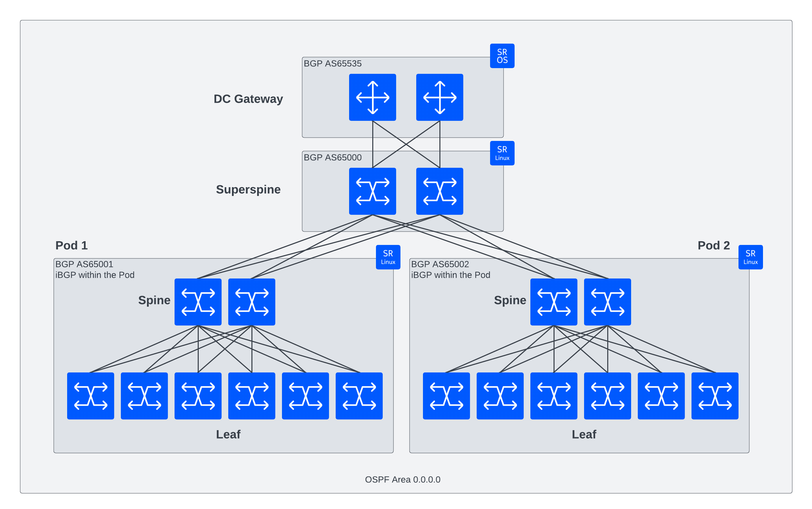
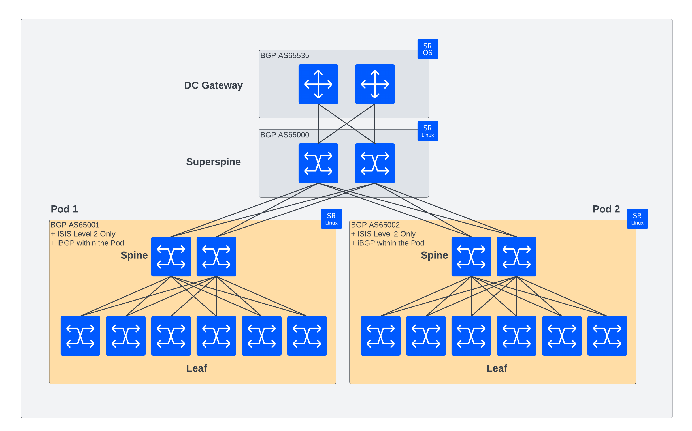
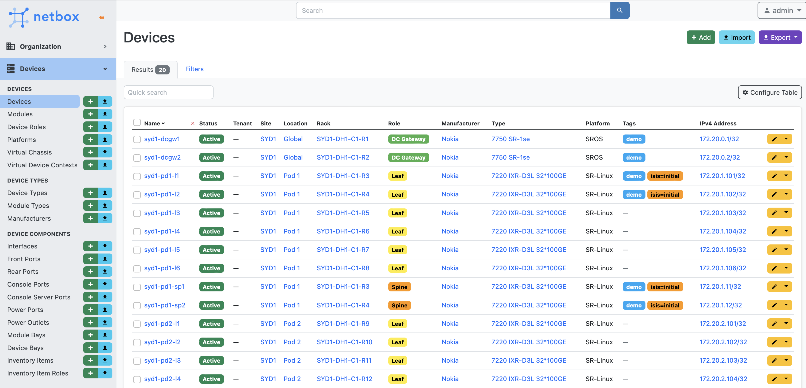
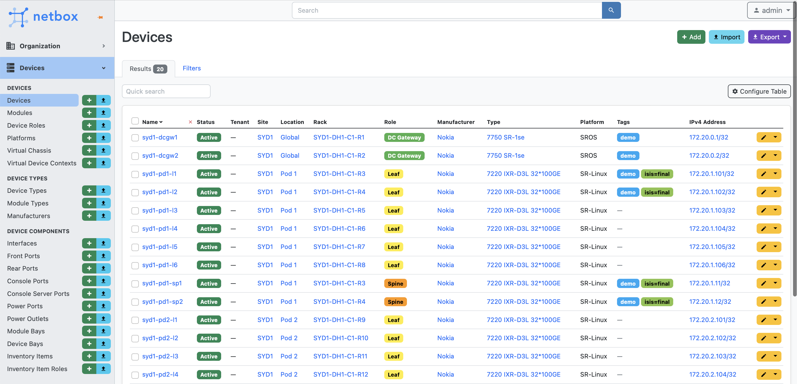

# Netbox + NetReplica + Containerlab
This lab aims to demonstrate how Containerlab can be used to create virtual replicas (Digital Twins) of your production network for lab use-cases.
Included in this lab are all the resources needed to deploy Netbox with seed data, configuration to use NetReplica to create a Containerlab topology file that creates a digital twin of the "Pod 1" and higher network elements. There is also a python script and associated templates required to perform basic configuration management of this network.

The demo described below goes through deploying these components and an illustration of how you can use Netbox and Containerlab to test a real-world operational process (changing IGPs) without downtime.

This is our sample network we'll be using:


## Requirements
* Ubuntu 22.04.4 LTS (or newer) OS
* Python 3.x (preferably 3.10) installed
* Python package `pyenv` installed in the system path
* Containerlab v0.51 or newer
* Docker 25.0 or newer and Docker Compose CLI Plugin

To install Containerlab, please follow the documented process: [containerlab.dev] (https://containerlab.dev/install/#install-script)

### Tested Software Versions
We have tested this lab on the following software versions:
* Ubuntu 22.04.4 LTS
* Containerlab v0.51.2
* Docker Engine (Community) 25.0.3
* Docker Compose (CLI Plugin) v2.24.5

## Running the Lab

### 1 - Clone and install the environment
```bash
> git clone https://github.com/srl-labs/netbox-nrx-clab
> cd netbox-nrx-clab
```

Then install the python virtual environment by running:
```
> ./1_create_venv.sh
```

Then activate the environment:
```
> source venv/bin/activate
```

### 2 - Install NetReplica (NRX)
Run the following:
```
> ./2_install_nrx.sh
```

The output should show the NetReplica repo being cloned along with the nested templates repository.

### 3 - Install Netbox
Install Netbox by running the following:
```
> ./3_deploy_netbox.sh
```
This should take 2-3 minutes depending on your internet connection speed. If the script fails, run it again until it succeeds.
You can check on the status of the Netbox install by running:
```
> cd ./netbox/
> docker compose ps
```
All components should be in a `healthy` status.

You can login to the Netbox User Interface using the following credentials:
Host: http://localhost:8000
Username: admin
Password: admin

### 4 - Run NetReplica 
Now run the NetReplica tool, `nrx` with some parametres defined in `nrx.conf`. NRX will talk to Netbox via it's API, query the `SYD1` site and built a Containerlab topology file based on the devices that have the `demo` tag attached to them. The output will be the `SYD1.clab.yaml` file in the root directory.

```
> ./4_run_nrx.sh
Reading platform map from: ./platform_map.yaml
Connecting to NetBox at: http://localhost:8000
Fetching devices from sites: ['SYD1']
Created clab topology: .//SYD1.clab.yaml
To deploy this topology, run: sudo -E clab dep -t .//SYD1.clab.yaml
```

If you inspect the `SYD1.clab.yaml` file, you'll see what's been built. We have SR-Linux Superspine, Spine and Leaf nodes all connected in the correct topology to match Netbox.


### 5 - Deploy the Digital Twin
Now create the Containerlab network by running deploy:
```
> clab deploy
```
This step may take a few minutes as the 6 nodes spin up. Once you're presented with the table below, you're good to go.
```
+---+------------------------+--------------+------------------------------+---------+---------+-----------------+----------------------+
| # |          Name          | Container ID |            Image             |  Kind   |  State  |  IPv4 Address   |     IPv6 Address     |
+---+------------------------+--------------+------------------------------+---------+---------+-----------------+----------------------+
| 1 | clab-SYD1-graphite     | 49994af28e63 | netreplica/graphite:latest   | linux   | running | 172.20.20.9/24  | 2001:172:20:20::9/64 |
| 4 | clab-SYD1-syd1-pd1-l1  | 7bae773ae0c7 | ghcr.io/nokia/srlinux:latest | srl     | running | 172.20.20.7/24  | 2001:172:20:20::7/64 |
| 5 | clab-SYD1-syd1-pd1-l2  | 9dda492df74d | ghcr.io/nokia/srlinux:latest | srl     | running | 172.20.20.5/24  | 2001:172:20:20::5/64 |
| 6 | clab-SYD1-syd1-pd1-sp1 | 4ec29e6e7a70 | ghcr.io/nokia/srlinux:latest | srl     | running | 172.20.20.6/24  | 2001:172:20:20::6/64 |
| 7 | clab-SYD1-syd1-pd1-sp2 | 665f5131ed5c | ghcr.io/nokia/srlinux:latest | srl     | running | 172.20.20.8/24  | 2001:172:20:20::8/64 |
| 8 | clab-SYD1-syd1-ss1     | 64cab8f5416d | ghcr.io/nokia/srlinux:latest | srl     | running | 172.20.20.4/24  | 2001:172:20:20::4/64 |
| 9 | clab-SYD1-syd1-ss2     | 217147faf77d | ghcr.io/nokia/srlinux:latest | srl     | running | 172.20.20.10/24 | 2001:172:20:20::a/64 |
+---+------------------------+--------------+------------------------------+---------+---------+-----------------+----------------------+
```

You'll notice there is an additional service there - `clab-SYD1-graphite`. This is a neat extra added by NetReplica - this is a UI accessible on `http://localhost:8080` that will show you the topology as generated by NRX and live in Containerlab.

You can also login to each device to see it's base config - e.g.:
```
> ssh admin@clab-SYD1-syd1-pd1-l1
Password: *********
Last login: Fri Feb 23 00:42:44 2024 from 2001:172:20:20::1
Using configuration file(s): ['/home/admin/.srlinuxrc']
Welcome to the srlinux CLI.
Type 'help' (and press <ENTER>) if you need any help using this.

--{ + running }--[  ]--
A:syd1-pd1-l1#
```
The default password for SR-Linux in this lab is `NokiaSrl1!`.

### 6 - Push configuration into the network
Included in this repo is a python script that can render templates and push configuration to the network. The script queries Netbox via it's API and configures interfaces (physical attributes, logical attributes and IPs) as well as protocols (OSPF, IS-IS and BGP). Based on the device role assigned to a device in Netbox, the correct template is chosen, rendered and pushed to the device with a diff of the changes.

```
> ./5_run_config_mgmt.sh
28-Feb-24 04:36:52 INFO # ### Network Configurator ###
28-Feb-24 04:36:52 INFO # Template Path: ./templates
28-Feb-24 04:36:52 INFO # Config Output Path: ./configs
28-Feb-24 04:36:52 INFO # Config Only: False
28-Feb-24 04:36:52 INFO # Commit: true
28-Feb-24 04:36:52 INFO # Diff: True
<further output with diffs >
```

The diffs in the above output should indicate to you what has changed. Try logging into some devices and check their protocol status. For SR-Linux you can run `show network-instance default protocols ospf neighbor` and `show network-instance default protocols bgp neighbor` to see neighbour status.

### 7 - Test a change using Netbox
The scenario we want to test in this lab is migrating from OSPF as our IGP globally, to isolated IS-IS instances that exist within the pod only. This is much more scalable and will reduce the control-plane processing required when participating in a global OSPF process. 

This is the final state we want to move to:


We will use device-level tagging in Netbox to inform our configuration management templates of which devices we want to change. 

Go into Netbox and apply the `isis=initial` tag to the two leaf and two spine nodes:


Now run the configuration management script again:
```
> ./5_run_config_mgmt.sh
28-Feb-24 04:36:52 INFO # ### Network Configurator ###
28-Feb-24 04:36:52 INFO # Template Path: ./templates
28-Feb-24 04:36:52 INFO # Config Output Path: ./configs
28-Feb-24 04:36:52 INFO # Config Only: False
28-Feb-24 04:36:52 INFO # Commit: true
28-Feb-24 04:36:52 INFO # Diff: True
<further output with diffs >
```

Once again, you should have some diffs that indicate that IS-IS configuration is being added to the l1, l2, sp1 and sp2 nodes.

Login to any of these devices to confirm:
```
--{ + running }--[  ]--
A:syd1-pd1-sp1# show network-instance default protocols isis adjacency
-----------------------------------------------------------------------------------------------------------------------------------------------------------------------------
Network Instance: default
Instance        : 0
Instance Id     : 0
+----------------+--------------------+-----------------+------------+--------------+-------+--------------------------+--------------------+
| Interface Name | Neighbor System Id | Adjacency Level | Ip Address | Ipv6 Address | State |     Last transition      | Remaining holdtime |
+================+====================+=================+============+==============+=======+==========================+====================+
| ethernet-1/1.0 | 0001.7220.1101     | L2              | 10.0.0.25  | ::           | up    | 2024-02-27T05:08:31.700Z | 20                 |
| ethernet-1/2.0 | 0001.7220.1102     | L2              | 10.0.0.27  | ::           | up    | 2024-02-27T05:08:31.700Z | 22                 |
+----------------+--------------------+-----------------+------------+--------------+-------+--------------------------+--------------------+
Adjacency Count: 2
```
We have some IS-IS adjacencies!

Now confirm we have OSPF and IS-IS routes in the routing table:
```
A:syd1-pd1-sp1# show network-instance default route-table ipv4-unicast prefix 172.20.1.12/32
------------------------------------------------------------------------------------------------------
IPv4 unicast route table of network instance default
------------------------------------------------------------------------------------------------------
+----------------------+------+-----------+---------+--------+-----------+-------------+-------------+
|        Prefix        |  ID  |   Route   | Active  | Metric |   Pref    |  Next-hop   |  Next-hop   |
|                      |      |   Type    |         |        |           |   (Type)    |  Interface  |
|                      |      |           |         |        |           |             |             |
|                      |      |           |         |        |           |             |             |
+======================+======+===========+=========+========+===========+=============+=============+
| 172.20.1.12/32       | 0    | isis      | False   | 20     | 18        | 10.0.0.25   | ethernet-   |
|                      |      |           |         |        |           | (direct)    | 1/1.0       |
| 172.20.1.12/32       | 0    | ospfv2    | True    | 8      | 10        | 10.0.0.8    | ethernet-   |
|                      |      |           |         |        |           | (direct)    | 1/27.0      |
+----------------------+------+-----------+---------+--------+-----------+-------------+-------------+
```

Now we have both OSPF and IS-IS prefixes. Currently the OSPF prefix is in use, but the IS-IS prefix has the higher protocol preference.
Once we remove OSPF, the IS-IS prefix should be made active - so lets do that.

Now go into Netbox again, remove the `isis=initial` tag and add the `isis=final` tag. 


Now run the configuration management again:
```
> ./5_run_config_mgmt.sh
28-Feb-24 04:36:52 INFO # ### Network Configurator ###
28-Feb-24 04:36:52 INFO # Template Path: ./templates
28-Feb-24 04:36:52 INFO # Config Output Path: ./configs
28-Feb-24 04:36:52 INFO # Config Only: False
28-Feb-24 04:36:52 INFO # Commit: true
28-Feb-24 04:36:52 INFO # Diff: True
<further output with diffs >
```

You should see diffs indicating OSPF is being removed. Once again, login to your device of choice - you should see only IS-IS routes in the routing table and the BGP neighbours should show a consistent uptime. This is because the OSPF routes have been withdrawn and the IS-IS routes have taken over as active - the process was entirely hitless to overlay traffic signalled with BGP for this pod.

Test success!!
